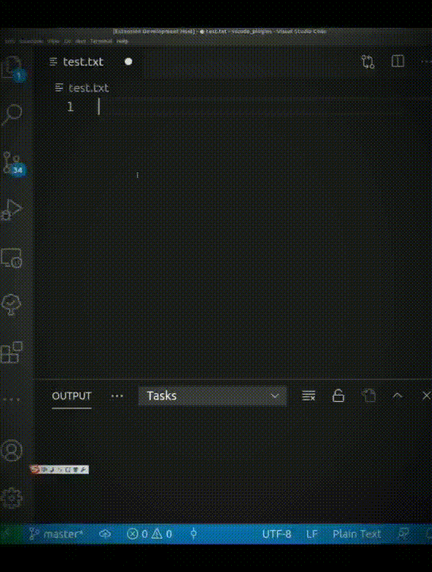
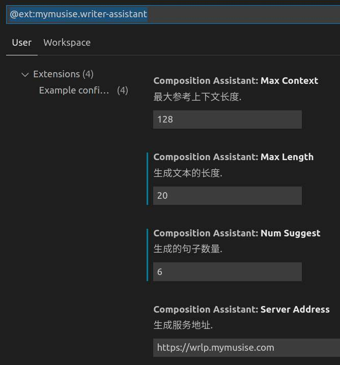

# Writer Assistant

一款基于生成模型GPT-2的写作助手，旨在提高写作速度和增加写作灵感。目前依托vscode平台，作为插件辅助用户写作。



## 安装

### 插件安装

通过[vscode市场](https://marketplace.visualstudio.com/items?itemName=mymusise.writer-assistant)可以直接安装下载插件, 也可以通过下载插件进行手动安装。

### 本地部署服务

- Docker

服务依托Docker，如果你的机器没有Docker, 下载安装参考[官网](https://docs.docker.com/get-docker/)

- 启动

```bash
docker run -d -p 23423:80 --name writer-assistant-server mymusise/writer-assistant-server
```

更具体的安装过程参考[详细文档](docs/README.md)

## 使用

打开需要编辑的Text， 编辑一个开口后，输入空格， 然后按 `Ctrl` + `I` 补全句子。

> 注意：打开的文本后缀必须是.txt, 新建的文本需要保存后才能自动补全。


## 设置参数

- `serverAddress`: 后台服务地址，本地部署后填写本地地址
- `maxContext`: 最大参考上下文长度（只参考上文）
- `maxLength`: 生成文本的最大长度（通用服务最长长度为8, 本地部署最长支持128）
- `numSuggest`: 推荐的句子数（通用服务一次最多推荐3个句子, 本地部署不受限制）




### 声明

项目用到的数据均来源网络，本项目未进行任何商业目的。本项目遵从[GPL协议](LICENSE)，引用请注明出处。
